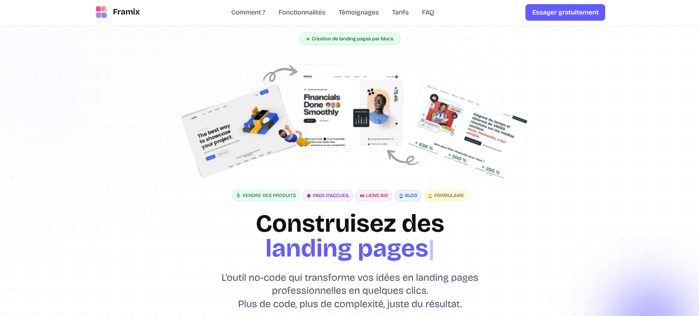
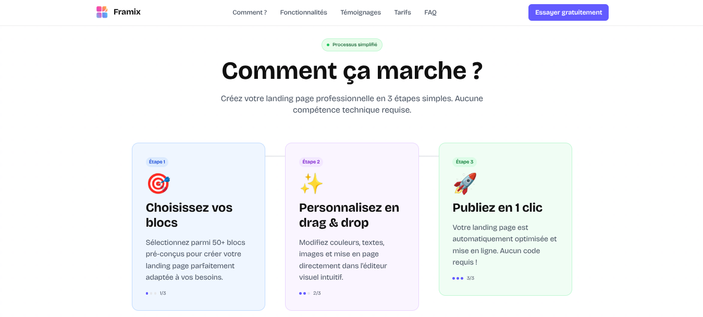
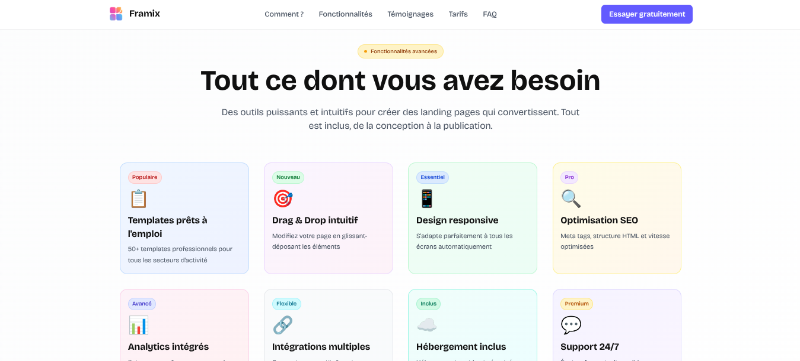
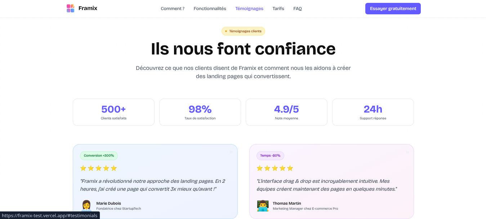
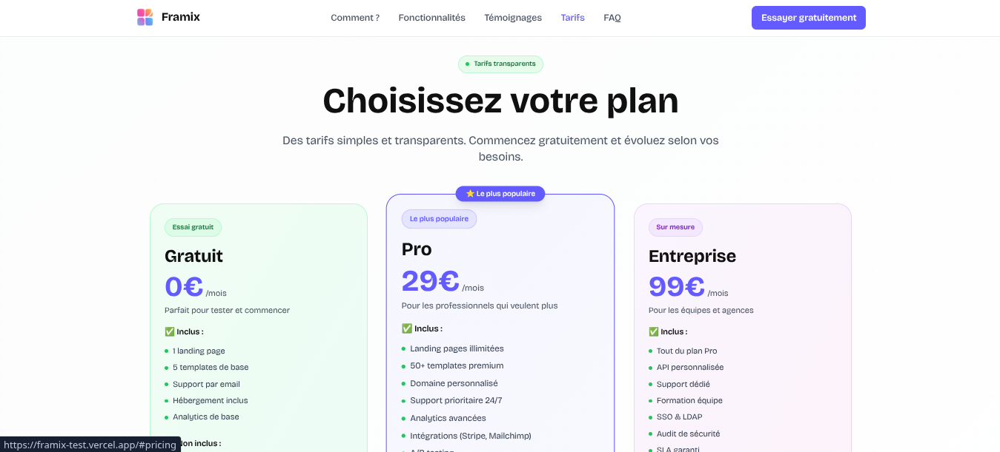
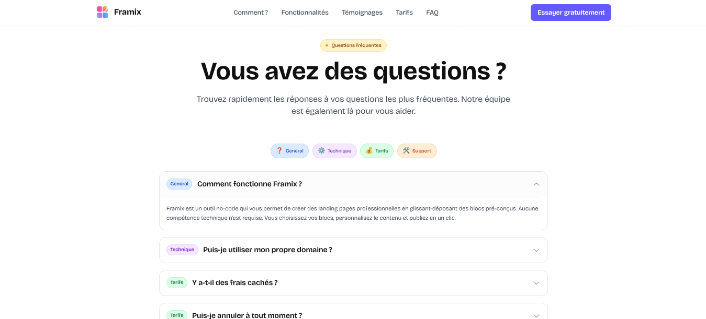

# Framix



**Framix** est une landing page moderne et responsive, conçue autour d'un outil fictif de création de landing pages par blocs en no-code.

> Ce projet n'a pas vocation à être un produit complet, mais représente une vitrine personnelle mettant en avant un design épuré, une expérience utilisateur soignée et un travail d'intégration abouti avec une approche no-code.

---

## 🛠 Stack utilisée

- **Astro** – Framework moderne pour sites statiques
- **React + TypeScript** – Composants interactifs
- **Tailwind CSS** – Styling utilitaire et responsive
- **Framer Motion** – Animations fluides et optimisées
- **PNPM** – Gestionnaire de paquets rapide

---

## 📸 Aperçu du site

### Section Hero


Section d'accueil avec titre animé, badges de fonctionnalités et call-to-action principal. Design épuré avec image SVG et boutons de fonctionnalités colorés.

### Section "Comment ça marche"



Présentation du processus en 3 étapes simples avec des cartes colorées, des icônes et des indicateurs de progression. Interface intuitive pour expliquer le workflow.

### Section Fonctionnalités



Grille de 8 fonctionnalités principales avec badges colorés, icônes et descriptions détaillées. Statistiques de confiance intégrées pour renforcer la crédibilité.

### Section Témoignages



Témoignages clients avec avis, notes par étoiles et badges de résultats. Section de confiance avec statistiques et call-to-action intégré.

### Section Pricing



3 plans tarifaires (Gratuit, Pro, Entreprise) avec fonctionnalités détaillées, badge "Le plus populaire" et garantie satisfait ou remboursé.

### Section FAQ



Accordéon interactif avec catégories colorées, questions/réponses organisées et section de support intégrée pour l'assistance utilisateur.

---

## 🚀 Objectifs

- Créer une **landing page complète et professionnelle** avec :  
  Hero, Processus, Fonctionnalités, Témoignages, Pricing, FAQ, CTA final.
- Intégrer un **design responsive** avec breakpoints professionnels (xs, sm, md, lg, xl, 2xl).
- Optimiser les **performances** en réduisant les animations superflues.
- Reproduire le **style moderne et épuré** des outils SaaS contemporains.

---

## 🎨 Caractéristiques du design

### Responsive Design

- **Breakpoints professionnels** : xs (320px+), sm (640px+), md (768px+), lg (1024px+), xl (1280px+), 2xl (1536px+)
- **Adaptation mobile-first** avec tailles de contenu optimisées
- **Grilles flexibles** qui s'adaptent à tous les écrans

### Direction Artistique

- **Palette de couleurs cohérente** : `#635BFF` (violet principal), `#7D76FF` (violet hover)
- **Badges colorés** pour chaque section avec codes couleur sémantiques
- **Dégradés subtils** et effets de transparence pour la profondeur
- **Typographie hiérarchisée** avec tailles adaptatives

### Optimisations Performance

- **Animations réduites** pour des performances optimales
- **Composants React optimisés** avec hydratation sélective
- **Images et assets optimisés** pour un chargement rapide

---

## 📦 Installation locale

Pour lancer le projet en local :

```bash
# 1. Cloner le dépôt
git clone https://github.com/michel-DC/Framix.git
cd Framix

# 2. Installer les dépendances
pnpm install

# 3. Lancer le serveur de développement
pnpm dev
```

Le site sera accessible à l'adresse : `http://localhost:3000`

---

## 🏗 Structure du projet

```
src/
├── components/
│   ├── sections/          # Sections de la landing page
│   ├── ui/               # Composants UI réutilisables
│   ├── header/           # Header du site
│   └── footer/           # Footer du site
├── layouts/              # Layouts Astro
├── pages/                # Pages du site
├── styles/               # Styles globaux
└── assets/               # Images et ressources
```

---

## 🎯 Fonctionnalités clés

- **Design responsive** avec breakpoints professionnels
- **Sections modulaires** facilement personnalisables
- **Optimisation SEO** avec meta tags et structure sémantique
- **Performance optimisée** avec animations réduites
- **Accessibilité** avec contrastes et navigation clavier
- **Code maintenable** avec TypeScript et composants React

---

## 📱 Compatibilité

- ✅ **Desktop** : Chrome, Firefox, Safari, Edge
- ✅ **Tablette** : iPad, Android tablets
- ✅ **Mobile** : iPhone, Android phones
- ✅ **Accessibilité** : Navigation clavier, lecteurs d'écran

---

## 🤝 Contribution

Ce projet est une vitrine personnelle, mais les suggestions d'amélioration sont les bienvenues via les issues GitHub.

---
